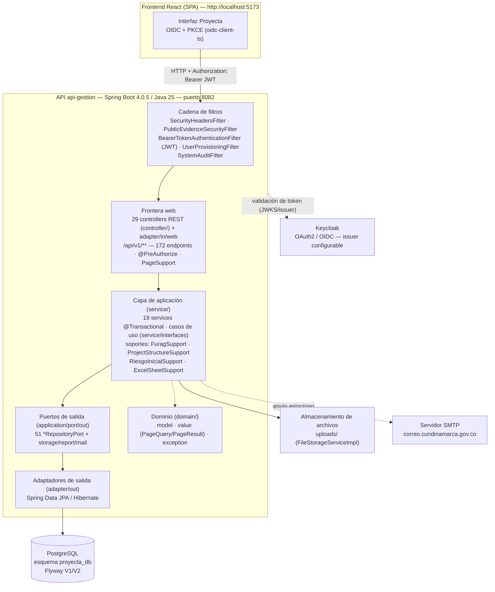
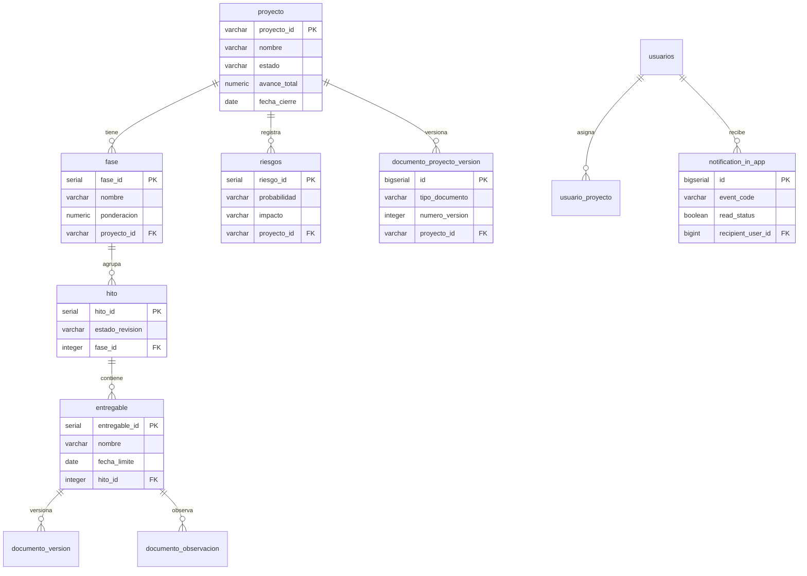
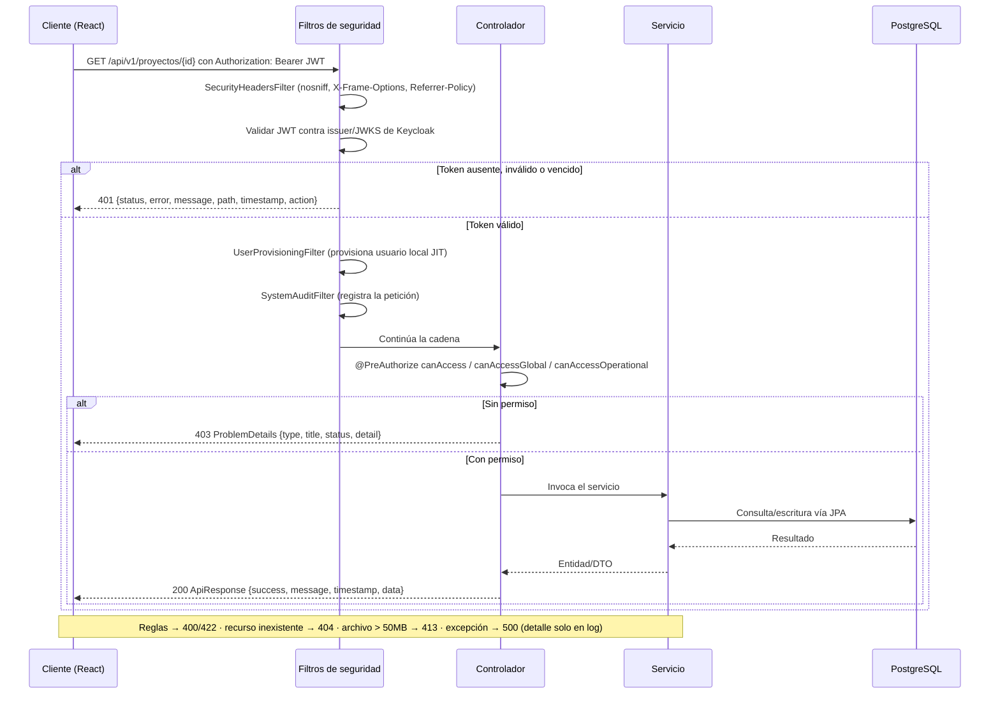
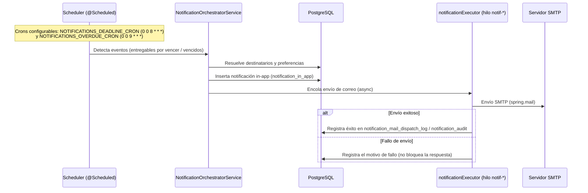

# Arquitectura Técnica — Proyecta (api-gestion)

| Campo             | Valor                                  |
| ----------------- | -------------------------------------- |
| **Proyecto**      | api-gestion (Proyecta)                 |
| **Versión**       | 1.2.0                                  |
| **Fecha**         | 2026-10-04                             |
| **Autor**         | _[Nombre del autor]_                   |
| **Revisor**       | _[Nombre del revisor]_                 |
| **Estado**        | Borrador                               |
| **Clasificación** | Interna                                |

> **Nota de diagnóstico (v1.0.0).** La versión 1.0.0 era una **plantilla genérica** de ejemplo: describía un módulo ficticio de "Seguimiento del Ciclo de Vida Documental" (`DocumentLifecycleController`, estados `BORRADOR → … → ARCHIVADO`, endpoints `/documents/**`, rol `app_access`) que **no existe** en el código fuente. La versión 1.1.0 lo sustituye por la arquitectura verificable del sistema real, conservando el formato institucional.

> **Nota v1.2.0 (2026-10-04).** Incorpora el estado de la **migración a arquitectura hexagonal + SOLID** ejecutada en las fases F0–F5 (ver [ADR-007](adr/ADR-007-arquitectura-hexagonal.md)): puertos de salida para los 51 repositorios, paginación de dominio (`PageQuery`/`PageResult`) con `PageSupport` en la frontera web, read-models en `application/readmodel`, 4 soportes SOLID extraídos de los services más grandes y **11 reglas ArchUnit** (`ArchitectureTest`) que fallan el build ante desviaciones. El contrato HTTP (endpoints + JSON) y el esquema Flyway V1/V2 **no cambian**.

---

## 1. Objetivo

Describir la arquitectura técnica del backend **api-gestion**, la API REST del sistema Proyecta: componentes, modelo de dominio persistido, flujos de datos, seguridad, decisiones de diseño, requisitos no funcionales e infraestructura, conforme al código de `src/main/java/com/proyecta/api_gestion/` y a la superficie API inventariada en [api-endpoints.md](api-endpoints.md).

---

## 2. Alcance

| Dentro del alcance                                            | Fuera del alcance                                       |
| ------------------------------------------------------------- | ------------------------------------------------------- |
| API REST `/api/v1/**`: 172 endpoints en 29 módulos            | Código fuente del frontend React (repositorio separado) |
| Seguridad OAuth2 Resource Server (JWT/Keycloak) y permisos     | Administración del servidor Keycloak y del realm        |
| Persistencia PostgreSQL con Flyway (V1/V2) y JPA/Hibernate     | Despliegue, redes y respaldos de la base de datos (DBA) |
| Notificaciones in-app y correo electrónico (SMTP)             | Pipeline de CI/CD y contenedores (no existen en el repo)|
| Almacenamiento y descarga de archivos (evidencias/documentos)  | Reglas de negocio específicas de cada módulo funcional  |
| Auditoría de peticiones y documentación OpenAPI               | Experiencia de usuario y diseño del frontend            |

---

## 3. Vista de Componentes

### 3.1 Diagrama de Componentes



### 3.2 Descripción de Componentes

| Componente                   | Responsabilidad                                                                      | Referencia en código                                                                        |
| ---------------------------- | ------------------------------------------------------------------------------------ | ------------------------------------------------------------------------------------------- |
| Cadena de filtros            | Cabeceras HTTP, rate limit/firma en rutas públicas, JWT, aprovisionamiento JIT y auditoría | `config/SecurityConfig.java`, `SecurityHeadersFilter`, `PublicEvidenceSecurityFilter`, `UserProvisioningFilter`, `SystemAuditFilter` |
| Frontera web (controllers)   | Exposición de endpoints, validación de entrada, `@PreAuthorize` y traducción de paginación (`PageSupport`) | `controller/` (29 clases + 12 interfaces), `adapter/in/web/` (`GlobalExceptionHandler`, `PageSupport`) |
| Capa de aplicación           | Casos de uso con `@Transactional`, permisos por proyecto, reportes y notificaciones  | `service/impl/` (19), `service/interfaces/` (15), `service/notification/`, `service/report/` |
| Soportes SOLID               | Colaboradores con SRP extraídos de los services más grandes (Fase 5)                 | `service/support/` (`FuragSupport`, `ProjectStructureSupport`, `RiesgoInicialSupport`), `service/report/ExcelSheetSupport` |
| Dominio                      | Modelo rico, valores (`PageQuery`/`PageResult`, `SortOrder`, `FileUpload`, `UserContext`) y excepciones | `domain/model/`, `domain/value/`, `domain/exception/` (85 clases)                            |
| Puertos de salida            | Contratos de persistencia/infraestructura sin Spring Data (51 repositorios + storage/report/mail) | `application/port/out/persistence/` (51), `application/readmodel/` (5 read-models)          |
| Adaptadores de salida        | Implementación de puertos: interfaces JPA espejo, correo, storage, reportes           | `adapter/out/persistence/` (51 interfaces JPA que `extend` su puerto)                       |
| Seguridad y autorización     | Conversión de roles desde el JWT y verificación de permisos                           | `service/security/dynamic/`, `service/security/LocalUserAuthorizationService`              |
| Manejo global de errores     | ProblemDetails RFC 9457 (400/403/404/413/422/500) y 401 propio                        | `exception/GlobalExceptionHandler.java`, `config/JwtAuthenticationEntryPoint.java`          |
| Persistencia                 | Mapeo objeto-relacional tras los puertos                                              | Spring Data JPA + Hibernate (`PostgreSQLDialect`, `ddl-auto=validate`)                      |
| Migraciones de esquema       | Esquema base y datos semilla                                                          | `db/migration/V1__creacion_esquema_base.sql`, `V2__datos_semilla_parametros.sql`            |
| Almacenamiento de archivos   | Guardado/descarga con validación de ruta y nombre                                     | `service/impl/FileStorageServiceImpl.java`                                                  |
| Notificaciones               | Orquestación de eventos, plantillas, in-app y correo                                  | `service/notification/`                                                                     |
| Documentación OpenAPI        | Definición global, esquemas de error y respuestas por operación                       | `config/openapi/OpenApiConfig.java`, `ErrorResponseOperationCustomizer.java`                |

### 3.3 Arquitectura hexagonal y reglas verificables (ADR-007)

La migración a arquitectura hexagonal con cumplimiento SOLID verificable se ejecutó en las fases **F0–F5** (2026-10). El mapa real de paquetes es:

```
com.proyecta.api_gestion/
├── domain/            # núcleo: model/ (72 @Entity), enums/, exception/, value/ (PageQuery, PageResult, SortOrder, FileUpload, UserContext)
├── application/
│   ├── port/out/      # 51 puertos *RepositoryPort (+ storage/report/mail) — sin org.springframework.data ni jakarta.persistence
│   └── readmodel/     # 5 read-models de proyección (EntregablePendienteDTO, ProyectoReporteResumenDTO, DashboardProjectSummaryDTO, …)
├── adapter/
│   ├── in/web/        # GlobalExceptionHandler y PageSupport (traducción PageQuery ↔ Page)
│   └── out/           # 51 interfaces JPA espejo: interface XJpaRepository extends JpaRepository<..>, XPuerto {}
├── controller/        # frontera web: 29 controllers + 12 interfaces (entrada PageQuery vía @RequestParam)
├── service/           # casos de uso @Transactional (impl/ 19, interfaces/ 15) + support/ soportes SOLID
├── dto/               # 120 DTOs de la frontera HTTP
├── config/            # composition root (SecurityConfig, CORS, async, Flyway, OpenAPI, Jackson)
└── infrastructure/    # utilidades transversales
```

**Cómo se paginar**: los controllers reciben `page`/`size`/`sort` como `@RequestParam` crudos y construyen `PageQuery` con `PageSupport.fromParams(...)` (replica el binding de Spring Data: página ≥ 0, `size` con default por endpoint y tope 2000, `?sort=campo,asc|desc` repetible); la respuesta se recompone como `Page<T>` de Spring (`PageSupport.toPage`) para **preservar el contrato JSON**. Los puertos y servicios solo conocen `PageQuery`/`PageResult` del dominio.

**11 reglas ArchUnit** en `src/test/java/com/proyecta/api_gestion/architecture/ArchitectureTest.java`, ejecutadas en cada `mvn test`:

| Regla | Verifica |
| ----- | -------- |
| **R1** | El dominio no depende de aplicación, adaptadores, DTOs ni Spring |
| **R1b** | En dominio solo se toleran `@JdbcTypeCode`/`SqlTypes` de Hibernate (imprescindibles para mapear columnas `jsonb`) |
| **R2** | La aplicación no depende de adaptadores ni de frameworks web |
| **R3a** | Interfaces JPA y repositorios solo en `adapter/out` |
| **R3b-i** | `org.springframework.data.domain` solo en adaptadores y frontera web |
| **R3b-ii** | Los controllers de spring-data solo usan `Page` (respuesta); `Pageable`/`Sort` están prohibidos |
| **R4a/R4b** | `adapter/in` y `adapter/out` no se conocen entre sí |
| **R5** | Los controllers no dependen de repositorios ni de adaptadores de salida |
| **R6** | Los DTOs viven en la frontera; `dto/` prohibido en dominio, aplicación y adaptadores de salida |
| **R7** | Cada puerto tiene un único adaptador (mapa puerto → implementador construido en `init()`) |

**Estado de la migración por fase**: F0 estructura de paquetes · F1 reglas R1/R2 + pureza de dominio · F2 puertos de salida (51) + traducción paginada `PageBridge` · F3 pureza de dominio (sin `domain→dto`), read-models en `application/readmodel` y R5–R7 · F4 eliminación de `Pageable` de la frontera (contrato JSON intacto) · F5 extracción SOLID de soportes (`ProyectoServiceImpl` 1713 → 1099 líneas, `ReporteServiceImpl` 1258 → 969). **Pendiente** respecto a ADR-007: mover `controller/` a `adapter/in/web`, crear `application/port/in` (casos de uso) y reubicar los DTOs de puerto en `application/port/in/dto`.

---

## 4. Modelo de Dominio

### 4.1 Diagrama de Entidades (relaciones principales del esquema V1)



### 4.2 Tablas por dominio (migraciones V1/V2)

| Dominio                    | Tablas principales                                                                                                                                                                    |
| -------------------------- | -------------------------------------------------------------------------------------------------------------------------------------------------------------------------------------- |
| Proyectos y cronograma     | `proyecto`, `fase`, `hito`, `entregable`, `objetivos_especificos`, `proyecto_equipo`, `proyecto_stakeholder`, `patrocinador`, `entregable_cambio_fecha`, `entregable_cambio_descripcion`, `proyecto_beneficio_impacto`, `respuestas_furag` |
| Riesgos                    | `riesgos`, `riesgo_tratamiento`, `riesgo_solucion_adjunto`, `riesgo_tratamiento_adjunto`, `matriz_riesgo`                                                                                |
| Documentos y evidencias    | `documento_proyecto_version`, `documento_version`, `documento_observacion`, `documento_auditoria`, `documento`, `documento_dinamico`, `documento_pre_wizard_revision`, `documento_interno`, `public_evidence_access`, `advance_report_uploads` |
| Notificaciones y auditoría | `notification_in_app`, `notification_log`, `notification_mail_dispatch_log`, `notification_event_catalog`, `notification_template`, `notification_preference`, `notification_audit`, `system_audit_log`, `analitica_portafolio_snapshot`, `auditoria_ponderaciones` |
| Cierre de proyecto         | `project_closure_template`, `project_closures`, `project_closure_question`, `project_closure_answer`, `actas_cierre`                                                                     |
| Seguridad y catálogos      | `usuarios`, `usuario_proyecto`, `usuario_permiso`, `roles`, `permisos`, `rol_permiso`, `system_parameters`, `lista_parametrica_config`, `reporte_config`, `estado_proyecto_config`, `estado_entregable_config`, `estado_riesgo_config`, `tipo_documento_config`, `estrategia_peti_config` |

> **V1** crea el esquema base (con índices, funciones y triggers); **V2** carga los datos semilla: 6 roles (`admin`, `gestor_tic`, `director_proyecto`, `auditor`, `consulta`, `visualizador`), permisos (`PROYECTO:VER`, `ENTREGABLE:EDITAR`, `SISTEMA:CONFIGURAR`, …), catálogos de estados, matriz de riesgo 5×5, parámetros, configuración de reportes, eventos y plantillas de notificación y plantillas/preguntas de cierre.

---

## 5. Flujo de Datos

### 5.1 Petición autenticada (JWT) y manejo de errores



### 5.2 Notificación asíncrona (in-app + correo)



---

## 6. Seguridad

### 6.1 Autenticación y autorización

| Aspecto          | Detalle                                                                                                                                     |
| ---------------- | --------------------------------------------------------------------------------------------------------------------------------------------- |
| **Mecanismo**    | OAuth2 Resource Server (JWT Bearer), sesión Stateless, CSRF deshabilitado                                                                    |
| **Proveedor**    | Keycloak (realm `gob-cundinamarca-devqa`)                                                                                                    |
| **Issuer**       | `${KEYCLOAK_ISSUER_URI:https://iamqa.cundinamarca.gov.co/realms/gob-cundinamarca-devqa}` (+ `KEYCLOAK_JWKS_URI`)                               |
| **Roles/claims** | Resueltos desde `realm_access.roles` y `resource_access.{clientId}.roles` (`GOB_RESOURCE_CLIENT_IDS`, por defecto `proyecta-web`). **No existe el claim `app_access`.** |
| **Permisos**     | Granularidad por proyecto con `@PreAuthorize`: `canAccess(...)`, `canAccessGlobal(...)`, `canAccessOperational(...)`, `canAccessOwnProjects`, `hasBaseAccess` |
| **Acceso base**  | `hasBaseAccess` exige usuario local en Proyecta con rol funcional (o administrador); sin él responde `403`                                   |
| **CORS**         | Orígenes en `GOB_CORS_ORIGINS` (por defecto `http://localhost:5173`), métodos GET/POST/PUT/DELETE/PATCH/OPTIONS                               |

### 6.2 Control de acceso por prefijo de URL

| Prefijo de URL                           | Control de acceso                                                                     |
| ---------------------------------------- | --------------------------------------------------------------------------------------- |
| `/api/v1/proyectos/**`                   | `canAccess(...)` / `canAccessOperational('<PERMISO>', #proyectoId, …)`                 |
| `/api/v1/admin/...`                      | `canAccessGlobal('SISTEMA:CONFIGURAR', ...)`                                           |
| `/api/v1/configuracion/...`              | `hasBaseAccess` (lectura), `canAccessGlobal('SISTEMA:CONFIGURAR')` (escritura)         |
| `/api/v1/reportes`, `/api/v1/analytics`  | `canAccessGlobal('PROYECTO:VER', …)` o `canAccessOperational(...)`                    |
| `/api/v1/public/...`                     | **Anónimo** (`@PublicEndpoint`): firma HMAC o token opaco + rate limit                |
| Rutas `permitAll`                        | `/api/public/**`, `/api/v1/public/**`, `/actuator/health`, `/actuator/info`, `/swagger-ui/**`, `/v3/api-docs/**`, `/swagger-ui.html`, OPTIONS `/**` |
| Resto (`/api/v1/**` y demás)             | `authenticated()`                                                                      |

### 6.3 Endpoints públicos (4 en `PublicEvidenceController`)

- Base path `/api/v1/public`; anonimato por requisito de negocio (consulta de evidencia sin login), protegido por `PublicEvidenceSecurityFilter` registrado con la mayor precedencia, antes de la cadena de Spring Security.
- **Firma HMAC** `?exp=&sig=` en todos los recursos salvo `/evidencia/{token}`, que usa **token opaco de 256 bits** (CWE-639 / OWASP A01).
- **Rate limit por IP**: `429` con cabecera `Retry-After: 60` (`PUBLIC_EVIDENCE_RATE_LIMIT`, por defecto 120 req/min).
- Firma inválida → `404` genérico `{"message":"Recurso no encontrado"}` (anti-enumeración).

### 6.4 Protección de cabeceras, logs y subidas

| Mecanismo               | Efecto                                                                                                                  |
| ----------------------- | ------------------------------------------------------------------------------------------------------------------------- |
| `SecurityHeadersFilter` | `X-Content-Type-Options: nosniff`, `X-Frame-Options: SAMEORIGIN`, `Referrer-Policy: no-referrer`, `X-Permitted-Cross-Domain-Policies: none` |
| `LogSanitizer`          | Evita inyección de líneas falsas en logs (CWE-117) y limita la longitud registrada                                      |
| `HttpHeaderSanitizer`   | Whitelist de caracteres en `Content-Disposition` (CWE-113 / CWE-64)                                                     |
| `UploadMimeSanitizer`   | MIME derivado de la extensión con allowlist; si no aplica → `application/octet-stream` (CWE-434 / CWE-79)                |
| `SystemAuditFilter`     | Registra usuario, rol, recurso, método, estado y duración en `system_audit_log`; redacta campos sensibles                |
| Errores 500             | Mensaje genérico al cliente; el detalle queda solo en el log (CWE-209)                                                   |

---

## 7. Decisiones de Diseño (ADRs)

### ADR-001: springdoc-openapi apagado por defecto (CWE-200)

- **Estado**: Aprobado
- **Contexto**: Exponer Swagger UI en producción revela la superficie completa de la API a usuarios no autenticados (enumeración de rutas y endpoints olvidados).
- **Decisión**: `springdoc.api-docs.enabled` y `springdoc.swagger-ui.enabled` son `false` por defecto; se habilitan solo en local con `SPRINGDOC_API_DOCS_ENABLED=true` y `SPRINGDOC_SWAGGER_UI_ENABLED=true`. `ErrorResponseOperationCustomizer` añade a cada operación los códigos de error reales (400/401/403/404/413/422/429/500).
- **Consecuencias**: la documentación no está disponible en el entorno de despliegue; debe consultarse/regenerarse en desarrollo.

### ADR-002: Historial Flyway consolidado en V1/V2, con cambios de esquema fuera de Flyway

- **Estado**: Aprobado
- **Contexto**: Las bases existentes ya tenían consolidado el historial de migraciones anteriores; reescribir el pasado causaría `FlywayValidateException: Migration checksum mismatch`.
- **Decisión**: Solo dos migraciones (`V1` esquema, `V2` semilla) con `spring.flyway.ignore-migration-patterns=*:missing,*:pending`, `ddl-auto=validate` y una `FlywayMigrationStrategy` que ejecuta `repair()` antes de `migrate()` (`FlywayConfig`). Los cambios puntuales se aplican con `CommandLineRunner` idempotentes fuera de Flyway (`DocumentoInternoSchemaEnsurer`, `AdvanceReportSchemaEnsurer`, `CerradoForzosoMigration`).
- **Consecuencias**: **nunca editar V1/V2 ya aplicados**; el esquema puede divergir entre ambientes si un ensurer falla (su error solo se registra en `WARN`).

### ADR-003: `ApiResponse` para éxito y ProblemDetails (RFC 9457) para errores

- **Estado**: Aprobado
- **Contexto**: el frontend necesita un envoltorio uniforme de éxito, pero se espera un estándar de errores interoperable.
- **Decisión**: éxito envuelto en `ApiResponse {success, message, timestamp, data}`; errores 400/403/404/413/422/500 en **Problem Details RFC 9457** `{type, title, status, detail}` (`GlobalExceptionHandler`); el **401** usa formato propio `{status, error, message, path, timestamp, action}` (`JwtAuthenticationEntryPoint`) para guiar la renovación de token.
- **Consecuencias**: el cliente debe ramificar el manejo del 401 respecto de los demás códigos.

### ADR-004: Notificaciones asíncronas con pools dedicados

- **Estado**: Aprobado
- **Contexto**: el envío de correos no puede bloquear la respuesta HTTP ni la ejecución de los schedulers.
- **Decisión**: `NotificationAsyncConfig` define `notificationExecutor` (core 2 / max 6 / cola 50, prefijo `notif-`), `taskExecutor` (core 4 / max 10 / cola 100, prefijo `async-`) y `taskScheduler` (pool 4), con `CallerRunsPolicy` para no perder trabajos; los crons son configurables por variable de entorno.
- **Consecuencias**: no hay cola persistente de reintentos: los fallos quedan en `notification_mail_dispatch_log` / `notification_audit` y requieren revisión.

### ADR-005: Endpoints públicos con `@PublicEndpoint` + HMAC/token opaco

- **Estado**: Aprobado
- **Contexto**: la consulta de evidencia debe funcionar sin sesión, pero los identificadores secuenciales permiten enumeración (IDOR).
- **Decisión**: la exención de autenticación solo se concede con la anotación `@PublicEndpoint` (hoy en un único controlador), combinada con firma HMAC con caducidad, token opaco de 256 bits y rate limit por IP (429 + `Retry-After`).
- **Consecuencias**: todo endpoint anónimo nuevo debe repetir este patrón; el secreto HMAC vive obligatoriamente en variable de entorno.

### ADR-006: Auditoría de peticiones por filtro, no por AOP

- **Estado**: Aprobado
- **Contexto**: se requiere trazabilidad de toda petición HTTP, incluidas las que no alcanzan un servicio.
- **Decisión**: `SystemAuditFilter` intercepta todas las peticiones y persiste en `system_audit_log` (usuario, rol, recurso, método, código de estado, duración), con redacción de secretos.
- **Consecuencias**: costo de E/S por petición, amortizado con escritura asíncrona.

### ADR-007: Arquitectura hexagonal (ports & adapters) con reglas ArchUnit

- **Estado**: Aprobado e **implementado (fases F0–F5, 2026-10-04)** — texto completo en [`docs/adr/ADR-007-arquitectura-hexagonal.md`](adr/ADR-007-arquitectura-hexagonal.md)
- **Contexto**: `controller → service → repository` mezclaba responsabilidades: controllers que inyectaban repositorios, services-gigante (`ProyectoServiceImpl` 1713 L) y acoplamiento a tipos de Spring Web (`Pageable`, `Authentication`, `MultipartFile`) fuera de la capa web.
- **Decisión**: dominio puro con paginación propia (`PageQuery`/`PageResult`), 51 puertos de salida implementados como interfaces JPA espejo, sin tipos de Spring Web en aplicación, y **11 reglas ArchUnit** (R1–R7 con exenciones R1b/R3b) que fallan el build ante desviaciones.
- **Consecuencias**: el contrato HTTP y el esquema Flyway no cambian; los tests de arquitectura aceleran la detección de regresiones estructurales; quedan pendientes declarados en §3.3 (ubicación de `controller/`, `application/port/in` y DTOs de puerto).

---

## 8. Requisitos No Funcionales

> **Implementado** = verificable en el código. **Aspiracional** = meta de diseño sin evidencia de implementación ni medición en este repositorio.

| Requisito              | Meta / estado actual                                                 | Estado         |
| ---------------------- | -------------------------------------------------------------------- | -------------- |
| Límite de subida       | 50 MB por archivo y 200 MB por petición (`413` al superarlos)        | Implementado   |
| Codificación y formato | UTF-8 forzado, fechas ISO 8601, UUID RFC 4122                        | Implementado   |
| Paginación             | `page` (0-indexed), `size` (default `20` por endpoint, tope `2000`), `sort` opcional (`?sort=campo,asc\|desc`); interno: `PageQuery`/`PageResult` | Implementado   |
| Apagado ordenado       | `server.shutdown=graceful` con timeout de 30 s                       | Implementado   |
| Pool de conexiones     | HikariCP: máximo 15, mínimo inactivo 5, keepalive y validación       | Implementado   |
| Hilos del servidor     | Tomcat: máximo 20 hilos, `accept-count` 100                          | Implementado   |
| Disponibilidad         | 99.5% mensual                                                        | Aspiracional   |
| Latencia               | < 200 ms p95 en lecturas                                             | Aspiracional   |
| Escalabilidad          | 500 usuarios concurrentes                                            | Aspiracional   |
| Observabilidad         | Health checks y métricas (`/actuator/**`)                            | Aspiracional\* |
| Retención y respaldo   | Retención de auditoría y respaldos de base de datos                  | Aspiracional   |
| Pruebas de carga       | Sin suite ni resultados de carga en el repositorio                   | Aspiracional   |

\* `SecurityConfig` permite `/actuator/health` e `/actuator/info`, pero `spring-boot-starter-actuator` **no figura en `pom.xml`**: esas rutas no existen en el binario actual.

---

## 9. Infraestructura

### 9.1 Stack Tecnológico

| Capa         | Tecnología / versión verificada                                                                       |
| ------------ | ------------------------------------------------------------------------------------------------------ |
| Lenguaje     | Java 25 (`java.version`, `<release>25`)                                                                |
| Framework    | Spring Boot **4.0.5** (padre en `pom.xml`) y Spring Framework 7                                        |
| Seguridad    | `spring-boot-starter-security` + `spring-boot-starter-oauth2-resource-server` (Keycloak)               |
| Persistencia | `spring-boot-starter-data-jpa` + Hibernate (`PostgreSQLDialect`, `ddl-auto=validate`)                  |
| Base de datos| PostgreSQL (driver `org.postgresql`); migraciones declaradas compatibles con PostgreSQL 15+            |
| Migraciones  | Flyway (`spring-boot-starter-flyway` + `flyway-database-postgresql`), esquema `proyecta_db`            |
| API y docs   | `springdoc-openapi-starter-webmvc-ui` **3.0.3** (Swagger UI deshabilitado por defecto)                 |
| Correo       | `spring-boot-starter-mail` (SMTP, TLSv1.2/1.3)                                                         |
| Documentos   | Apache PDFBox 3.0.4, OpenHTMLtoPDF 1.1.37, Apache POI 5.3.0, JFreeChart 1.5.5                         |
| Runtime      | Puerto `${SERVER_PORT:8082}`; frontend React en `http://localhost:5173`                                |
| Build        | Maven (`mvnw.cmd`, `maven-compiler-plugin` 3.13.0)                                                     |

> No hay `Dockerfile`, `docker-compose` ni workflows de CI/CD en este repositorio.

### 9.2 Variables de entorno (definidas en `application.properties`)

| Variable                              | Uso                                    | Valor por defecto                                          |
| ------------------------------------- | -------------------------------------- | ---------------------------------------------------------- |
| `SERVER_PORT`                         | Puerto del backend                     | `8082`                                                     |
| `DB_HOST` / `DB_PORT` / `DB_NAME` / `DB_SCHEMA` | Conexión PostgreSQL          | `localhost` / `5432` / `postgres` / `proyecta_db`          |
| `DB_USER` / `DB_PASSWORD`             | Credenciales de base de datos          | `postgres` / *(sin default)*                               |
| `DB_POOL_MAX` / `DB_POOL_MIN_IDLE`    | Tamaño del pool Hikari                 | `15` / `5`                                                 |
| `KEYCLOAK_ISSUER_URI`                 | Issuer JWT validado                    | `https://iamqa.cundinamarca.gov.co/realms/gob-cundinamarca-devqa` |
| `KEYCLOAK_JWKS_URI`                   | Conjunto de claves públicas            | `.../protocol/openid-connect/certs` del mismo realm        |
| `GOB_RESOURCE_CLIENT_IDS`             | ClientIds cuyos roles se leen          | `proyecta-web`                                             |
| `GOB_CORS_ORIGINS`                    | Orígenes CORS permitidos               | `http://localhost:5173`                                     |
| `GOB_SEED_ADMIN_USERNAME`             | Cuenta admin sembrada en cada arranque | `fasantos`                                                 |
| `PUBLIC_EVIDENCE_HMAC_SECRET`         | Secreto de firma de rutas públicas     | *(vacío; obligatorio en despliegue)*                        |
| `PUBLIC_EVIDENCE_EXPIRY_DAYS`         | Caducidad de enlaces públicos          | `30`                                                       |
| `PUBLIC_EVIDENCE_RATE_LIMIT`          | Req/min por IP en rutas públicas       | `120`                                                      |
| `MAIL_HOST` / `MAIL_PORT`             | Servidor SMTP                          | `correo.cundinamarca.gov.co` / `25`                         |
| `MAIL_USERNAME` / `MAIL_PASSWORD`     | Autenticación SMTP                     | *(vacíos)*                                                 |
| `MAIL_FROM`                           | Remitente visible                      | `notificaciones_proyecta@cundinamarca.gov.co`              |
| `MAIL_NOTIFICATION_ENABLED`           | Habilita envío real de correos         | `true`                                                     |
| `NOTIFICATIONS_DEADLINE_CRON`         | Aviso de entregables por vencer        | `0 0 8 * * *`                                              |
| `NOTIFICATIONS_OVERDUE_CRON`          | Recordatorio de entregables vencidos   | `0 0 9 * * *`                                              |
| `MAX_FILE_SIZE` / `MAX_REQUEST_SIZE`  | Límites multipart                      | `50MB` / `200MB`                                           |
| `SPRINGDOC_API_DOCS_ENABLED` / `SPRINGDOC_SWAGGER_UI_ENABLED` | OpenAPI on/off       | `false` / `false`                                          |
| `APP_FRONTEND_URL_BASE`               | Enlaces del frontend en notificaciones | `http://localhost:5173`                                     |
| `APP_PUBLIC_URL_BASE`                 | URL pública para enlaces HMAC          | `http://localhost:8082`                                     |
| `TOMCAT_THREADS_MAX`                  | Hilos del contenedor                   | `20`                                                       |
| `LOG_LEVEL_APP` / `LOG_LEVEL_SQL`     | Nivel de logging                       | `INFO` / `WARN` (SQL `WARN`, bind `OFF`)                    |

---

## 10. Riesgos y Mitigaciones

| Riesgo                                                                                   | Impacto | Probabilidad | Mitigación existente / recomendada                                            |
| ---------------------------------------------------------------------------------------- | ------- | ------------ | ------------------------------------------------------------------------------ |
| Indisponibilidad del SMTP corporativo (puerto 25, sin autenticación por defecto)          | Alto    | Medio        | `MAIL_NOTIFICATION_ENABLED=false`; fallos registrados en `notification_mail_dispatch_log` |
| Fuga de secretos en variables de entorno (`MAIL_PASSWORD`, `PUBLIC_EVIDENCE_HMAC_SECRET`) | Alto    | Medio        | Nunca en git (CWE-798); usar gestor de secretos del despliegue                 |
| Dependencia total de Keycloak (`iamqa.cundinamarca.gov.co`)                               | Alto    | Media        | Emisión/validación de token fuera del control de la API → degradación = 401 masivo |
| Deriva de esquema por migraciones ignoradas (`*:pending`) y ensurers que fallan en `WARN` | Alto    | Medio        | `ddl-auto=validate` detecta diferencias al arrancar; revisar logs de ensurers  |
| Documentación OpenAPI apagada en despliegue → endpoints sin actualizar                    | Medio  | Media        | Prueba `OpenApiDocsGenerationTest` y regeneración local con springdoc activo   |
| Sin observabilidad real (sin `actuator`, métricas ni health checks)                       | Medio  | Alta         | Añadir `spring-boot-starter-actuator` restringido a la red interna             |
| Sin CI/CD ni contenedores en el repositorio → despliegues manuales                       | Medio  | Alta         | Automatizar build (`mvnw`) y empaquetado del JAR                                |
| Valores semilla por defecto (`GOB_SEED_ADMIN_USERNAME`) no sobrescritos                   | Medio  | Media        | Sobrescribir por variable de entorno en cada ambiente                           |
| Concurrencia limitada (20 hilos Tomcat, pool de 15) ante picos                            | Medio  | Baja         | Medir con pruebas de carga antes de fijar metas de escalabilidad                |

---

## 11. Glosario

| Término               | Definición                                                                                      |
| --------------------- | ------------------------------------------------------------------------------------------------ |
| **ApiResponse**       | Envoltorio estándar de respuestas exitosas: `success`, `message`, `timestamp`, `data`            |
| **Problem Details**   | Formato de error HTTP RFC 9457: `type`, `title`, `status`, `detail`                              |
| **JWT / Bearer**      | Token firmado por Keycloak enviado en `Authorization: Bearer`                                    |
| **`@PreAuthorize`**   | Anotación de Spring Security que evalúa permisos por método (`canAccess*`, `hasBaseAccess`)       |
| **`@PublicEndpoint`** | Anotación que marca un endpoint como anónimo y lo obliga a usar HMAC/rate limit                  |
| **HMAC**              | Firma con secreto compartido usada en los enlaces públicos (`?exp=&sig=`)                         |
| **Rate limit**        | Límite de peticiones por IP; responde `429` con `Retry-After`                                     |
| **Flyway**            | Migraciones versionadas del esquema (`V1`, `V2`)                                                  |
| **Ensurer**           | `CommandLineRunner` idempotente que aplica cambios de esquema fuera de Flyway                     |
| **SystemAuditFilter** | Filtro que audita cada petición HTTP en `system_audit_log`                                        |
| **CWE**               | Common Weakness Enumeration: taxonomía de debilidades usada para justificar decisiones            |
| **HikariCP**          | Pool de conexiones a base de datos de Spring Boot                                                 |

---

## 12. Referencias

- Inventario de superficie API: [docs/api-endpoints.md](api-endpoints.md)
- Guía del proyecto y arranque local: [README.md](../README.md)
- Problem Details for HTTP APIs (RFC 9457): <https://www.rfc-editor.org/rfc/rfc9457>
- Spring Boot Reference Documentation: <https://docs.spring.io/spring-boot/reference/>
- springdoc-openapi: <https://springdoc.org/>
- CWE-200 (Exposure of Sensitive Information): <https://cwe.mitre.org/data/definitions/200.html>

---

## 13. Historial de Revisiones del Documento

| Versión | Fecha      | Autor           | Cambios realizados                                              |
| ------- | ---------- | --------------- | ---------------------------------------------------------------- |
| 1.0.0   | 2026-07-29 | _[Autor]_       | Creación inicial del documento (plantilla genérica de ejemplo)  |
| 1.1.0   | 2026-09-29 | Equipo Proyecta | Actualización con arquitectura real del sistema                 |
| 1.2.0   | 2026-10-04 | Equipo Proyecta | Migración hexagonal + SOLID (fases F0-F5): puertos de salida, paginación de dominio, read-models, soportes SOLID y 11 reglas ArchUnit (§3.3, ADR-007) |
